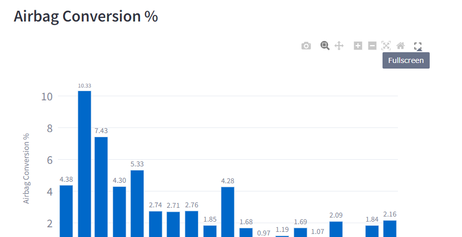

# Honda
The services available for the Honda account include:
* Ask Dave.
* High Deliverability.
* Informed Delivery.
* Remedy Spike
* Ask Dave

## Ask Dave
The first step before using the Ask Dave automation is to ensure that your data files are compressed as a ZIP file following the following folder structure `data-folder/month/file.xlsx>`.
The backend logic will handle the computation of the Ask Dave summary, allowing the user to see summary plots and download the summary file as an xlsx (excel) file.
The logic of how the calculations are made can be explained by the pseudocode:

```python
# Iterate over each month's file
for each file in month_files:
    # Calculate the monthly summary
    total_actual_convs = df.iloc[0:1, 1:2].values[0][0] # Get the values from the correct column
    avg_daily_conv = total_actual_convs / len(df) # len(df) is the no. of rows of that month's file
    total_airbg_convs = df.iloc[0:1, 2:3].values[0][0]
    airbg_conv_pct = df.iloc[0:1, 3:4].values[0][0] * 100 # to percentage
    total_after_hrs_convs = df.iloc[0:1, 4:5].values[0][0]
    after_hrs_conv_pct = df.iloc[0:1, 5:6].values[0][0] * 100 # pct
    callback_rqsts = df.iloc[0:1, 6:7].values[0][0]
    
    # Create a dictionary for the summary of the current month
    summary_dict = {
        'Month': month,
        'Total Actual Conversions': total_actual_convs,
        'Average Daily Conversion': avg_daily_conv,
        'Total Airbag Conversions': total_airbg_convs,
        'Airbag Conversion %': airbg_conv_pct,
        'Total After Hours Conversions': total_after_hrs_convs,
        'After Hours Conversion %': after_hrs_conv_pct,
        'Callback Requests': callback_rqsts
    }

    # Append the summary dictionary to the monthly_summary list
    monthly_summary.append(summary_dict)

# Convert the list of dictionaries to a DataFrame
monthly_summary_df = pd.DataFrame(monthly_summary)

# Generate plots from the monthly_summary_df

```
### Toggle Fullscreen
On the generated plots, for each plot, there is an option to view the chart on full screen as shown below:


### Download Chart
There is also an option to download each chart as shown below:


## High Deliverability
Similar to Ask Dave, ensure you have the data files zipped in the folder structure mentioned above.
Ensure that the number of files and the months included in your zipped folder is correct as this will be displayed during the computation of High Deliverability thus allowing you to confirm the correctness of the input data.
The logic used for High Deliverability can be explained by the pseudocode:
```python
for each month:
    # Get the files and store in a dictionary where the month
    # is the key and the dataframes (dfs) for that month are the values
    # This variable is called dataframes_dict
    
for each month, df in dataframes_dict.items(): # key - values
    # clean the df
    # Extract the month
    # Append the cleaned DataFrame to the list for the month
    monthly_combined_dfs = {}
    for month, dfs in monthly_dataframes.items():
        
        combined_df = pd.concat(dfs, ignore_index=True) # concatenate
        monthly_combined_dfs[month] = combined_df
    
# The function to calculate the pct is applied to each row as follows
def calculate_percentage(row, total, delivered_total, unique_opens_total):
    """
    Total is the sum total (ideally last row of each file for each month
    """
    if row['ordered'] == 'Delivered': # if row value of the column 'ordered' is 'Delivered'
        return (row['num'] / total)*100 # pct
    elif row['ordered'] == 'Unique Clicks To Opens':
        return (row['num'] / unique_opens_total)*100
    elif row['ordered'] == 'total':
        return 100
    else:
        return (row['num'] / delivered_total)*100
    
# This is how the calculate_percentage method is used
full_dfs = {}
grouped_dfs = []
raw_dfs = []

for month, dfs in monthly_combined_dfs.items():
    total # get sum total of 'total'
   
    Filter out rows where the value of the column 'Ordered' is 'total'
    # Filter to obtain monthly_df_grouped
    
    # Where the row value of the col 'ordered' is 'Delivered'
    Get delivered_total 
    
    # Get the total for 'Unique Opens'
    unique_opens_total
    
    # calcualte the percentage
    monthly_df_grouped['percentage'] = monthly_df_grouped.apply(calculate_percentage,
                                                                axis=1, 
                                                                total=total,
                                                                delivered_total=delivered_total, 
                                                                unique_opens_total=unique_opens_total)
    monthly_df_grouped['month'] = month
    monthly_combined_dfs[key]['month'] = month
    
    # Add to the list for concatenation
    grouped_dfs.append(monthly_df_grouped)
    raw_dfs.append(monthly_combined_dfs[month])

# Concatenate all DataFrames
full_dfs['grouped'] = pd.concat(grouped_dfs, ignore_index=True)
full_dfs['raw'] = pd.concat(raw_dfs, ignore_index=True)

# Print the keys of full_dfs
print(full_dfs.keys())

# The output would look something like:
230128.0
240725.0
241752.0
158338.0
153040.0
149391.0
146643.0

dict_keys(['grouped', 'raw']) # Raw dfs are ungrouped
        
# This is the logic used to filter the dfs
# Dictionary to store DataFrames grouped by campaign type
campaign_dfs = {}

# Group the DataFrame by campaign type using df.loc
for campaign_type in campaign_types:
    # Adjust the campaign type filter to match the actual campaign column values
    filtered_df = full_dfs['raw'][full_dfs['raw']['campaign'].str.contains(campaign_type, regex=False)]
    
    # Check if the filtered DataFrame is not empty
    if not filtered_df.empty:
        # Store the filtered DataFrame in the dictionary
        campaign_dfs[campaign_type] = filtered_df

# Examples of campaign types categorized by month:
'Acura_Recall_January_24__Acura_DAB_1834',
 'Acura_Recall_January_24__Acura_DAB_35+',
 'Acura_Recall_January_24__Acura_PAB',
 'Honda_Recall_January_24__Honda_DAB_1834',
 'Honda_Recall_January_24__Honda_DAB_35+',
 'Honda_Recall_January_24__Honda_PAB',
 'Honda_Acura_Recall_February_24__Erdman',
 'Honda_Acura_Recall_February_24__PAB',
```
The download logic is similar to that of Ask Dave.

## Informed Delivery
The file upload and chart download work the same as the services described earlier on in this documentation.

The firs step is to load the files by month. The processing of this can be summarized by the following pseudocode:
```python
# Steps:
# 1. Initialize an empty dictionary data_frames_by_month.
for each month and its corresponding list of files in month_dirs (zipped folder):
    Create a new list in data_frames_by_month for the current month.
    for each file in files:
         Attempt to load the file based on its extension:
            # - .xlsx, .XLSX, .XLS → Load as Excel file.
            # - .csv → Load as CSV file.
            # - Unsupported formats → Skip with a warning.
         if the file loads successfully:
            Remove rows with missing values.
            Standardize column names (replace spaces with underscores, convert to lowercase).
            Drop unnecessary columns (sp_code if present).
            Ensure numeric columns are converted to numeric types.
            Append the cleaned data frame to the month's list in data_frames_by_month.

```
The next step is the aggregation of the data by campaign
```python
# The input is a single dataframe, from the step above
# this is done for all the dataframes cleaned above
# The output is a grouped dataframe summarizing the campaign metrics

# Steps:
# 1. Group the data by campaign title
# 2. Aggregate columns
# 3. Return the grouped dataframe.
```
The next step is to extract the campaign metrics by month
```python
# Input - data_frames_by_month with cleaned dataframes for each month
# Output - Dictionary month_campaigns summarizing metrics for each campaign by month

# Steps
# 1. Initialize an empty dictionary in month_campaigns for the current month
For each dataframe (df) in the data_frames_by_month:
    for each row in the df
        Retrieve campaign_title, skip rows without it
        if campaign_title is not already in month_campaigns[month]:
            initialize its metrics
        Extract and validate required numeric columns.
        Compute derived metrics # match rate, email rate, open rate, click rate.
        Populate campaign_title metrics in month_campaigns[month]
        
final result → the populated month_campaigns

# Here is a snippet of how the calculations are made for each row
match_rate = id_eligible / dm_audience if (id_eligible is not None and dm_audience is not None) else None
email_rate = email_sent / id_eligible if (email_sent is not None and id_eligible is not None) else None
open_rate = email_open / email_sent if (email_open is not None and email_sent is not None) else None
click_rate = click / email_open if (click is not None and email_open is not None) else None
```
## Remedy Spikes
The file upload for this differs slightly from those mentioned already in that you upload a single xlsx file for that month e.g.
`<filename_for_month_year.xlsx>`.
The first step is to upload the file and then the moving average is calculated. Below is the logic used in calculating the moving average:
```python
# Steps to calculate the moving average:
# 1. Initialize an empty dataframe ma_df to store the moving averages
# 2. Iterate over the columns in the input df (PGi - PGk), where i=1 and k=max value
     for each column
        if the column is not VEH_RECALL_CMPLTN_DT:
           perform a rolling window of size 7 (1 week) to the column
           Calculate the mean of the rolling window
           Add the resulting moving average series to ma_df under the same column name
        if the column is VEH_CMPLTN_DT
           Directly copy the column to ma_df without modification
           
# 3. Remove the colulmn GRAND_TOTAL from ma_df (if it exists)
# 4. Set VEH_CMPLTN_DT as the index of ma_df
# 5. Return the resulting datframe ma_df
# 6. Generate a plot based the filtered start and/r end dates.
```
A brief preview will be generated after the computation of the moving averages after which you will be required to enter a start and/or end date to filter the chart to the time range of your liking.
The download feature works the same as the others above.